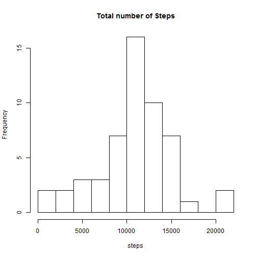
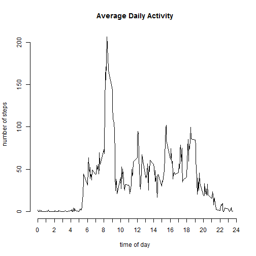
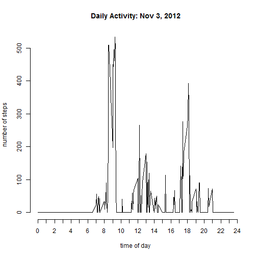
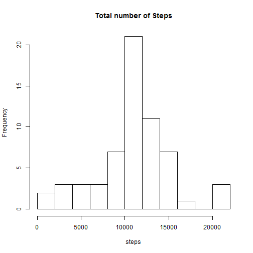
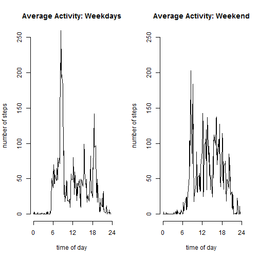
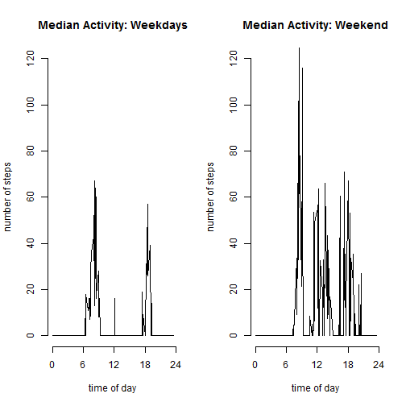

Personal Activity Monitor: Steps
========================================================

The script below retrieves and analyzes the number of steps taken in five minute intervals by an anonymous individual
over the course of two months (October/November 2012).

You can retrieve the [raw data here.] (http://d396qusza40orc.cloudfront.net/repdata%2Fdata%2Factivity.zip)

In general the data consists of 288 (24 x 12 per hour)  observations each day. Unavailable data is encoded as NA. 
Intervals when the subject was not walking will show zero steps.

## Loading the data


```r

fname <- "http://d396qusza40orc.cloudfront.net/repdata%2Fdata%2Factivity.zip"
tf <- tempfile()
download.file(fname, tf)

unzip(tf, "activity.csv")

raw <- read.csv("activity.csv", colClasses = c("numeric", "Date", "numeric"))
```


## Take a quick peek at the data


```r
dim(raw)
```

```
## [1] 17568     3
```

```r
names(raw)
```

```
## [1] "steps"    "date"     "interval"
```

```r
missing <- tapply(is.na(raw$steps), raw$date, sum)
missing[!missing == 0]
```

```
## 2012-10-01 2012-10-08 2012-11-01 2012-11-04 2012-11-09 2012-11-10 
##        288        288        288        288        288        288 
## 2012-11-14 2012-11-30 
##        288        288
```


### Note that when data is missing for the current sample, it's missing for the whole day!


```r
byday <- with(raw, tapply(steps, date, sum))
hist(byday, breaks = 9, xlab = "steps", main = "Total number of Steps")
```

 

```r

### Some summary statistics by day for reference

summary(byday)
```

```
##    Min. 1st Qu.  Median    Mean 3rd Qu.    Max.    NA's 
##      41    8840   10800   10800   13300   21200       8
```

```r

### And similar statistics for each five minute interval

byinterval <- with(raw, tapply(steps, interval, mean, na.rm = T))

summary(byinterval)
```

```
##    Min. 1st Qu.  Median    Mean 3rd Qu.    Max. 
##    0.00    2.49   34.10   37.40   52.80  206.00
```

```r

## Graphing average activity throughout the day

hours <- raw$interval[1:288]/100
plot(hours, byinterval, axes = F, type = "l", xlab = "time of day", ylab = "number of steps", 
    main = "Average Daily Activity")
axis(side = 1, at = 0:24)
axis(side = 2)
```

 

```r

whenmax <- which(byinterval == max(byinterval))
whenmax <- as.numeric(names(byinterval))[whenmax]
whenmax <- whenmax/100
```


*Maximum activity seems to occur in the five minute interval starting at 8.35*

**Note that the data above is highly averaged. Compare with results for just one day below. Activity comes in tighter, more pronounced bursts.**

 


## Correcting for missing days

As noted above, data is missing for 8 days (2304 observations).  

Below is an attempt to correct for missing data. Because I think that using averaged data may yield misleading results for most purposes, I have chosen to directly substitute a representative day for the missing one. Average results will likely not change much given the method chosen.

Representative days are chosen according to the following criteria:

- substitute day can't be missing data itself!
- same day of the week
- in the nearest week available

*A different strategy may be required if interday data is missing --- I would still recommend replacement over averaging results*

*Spoiler Alert: The graph at the very end of this page shows why one has to be cautious.


```r

dates <- as.Date(names(missing))  ## All dates in sample
dow <- weekdays(as.Date(names(missing)))  ## corresponding day of the week

repone <- function(baday) {
    
    # returns the first date for which data is available that matches the day of
    # the week for the argument < baday >
    
    # checks for validity should be performed elsewhere uses globals missing,
    # dow and dates from .Rmd environment
    
    use <- missing == 0  ## days without missing data
    okdow <- dow[use]
    okdates <- dates[use]
    
    baday <- as.Date(baday)  # just in case it comes in as character from a name field
    badow <- weekdays(baday)
    
    avail <- okdates[okdow == badow]  ## same day of week
    r <- abs(as.numeric(avail - baday))  ## how far away is it
    avail <- avail[which(r == min(r))]  ## nearest available  
    avail[1]  ##indexed so only one day gets picked!
}

repall <- function() {
    
    ## wrapper to replace missing data
    
    out <- raw
    
    tofix <- missing[!missing == 0]
    tofix <- as.Date(names(tofix))
    
    for (k in 1:length(tofix)) {
        out[out$date == tofix[k], c(1, 3)] <- raw[raw$date == repone(tofix[k]), 
            c(1, 3)]
    }
    
    out
    
}

fixed <- repall()  # fix data

summary(fixed)  # quick summary of fixed data
```

```
##      steps            date               interval   
##  Min.   :  0.0   Min.   :2012-10-01   Min.   :   0  
##  1st Qu.:  0.0   1st Qu.:2012-10-16   1st Qu.: 589  
##  Median :  0.0   Median :2012-10-31   Median :1178  
##  Mean   : 37.6   Mean   :2012-10-31   Mean   :1178  
##  3rd Qu.: 12.0   3rd Qu.:2012-11-15   3rd Qu.:1766  
##  Max.   :806.0   Max.   :2012-11-30   Max.   :2355
```

```r
summary(raw)  # for comparison
```

```
##      steps            date               interval   
##  Min.   :  0.0   Min.   :2012-10-01   Min.   :   0  
##  1st Qu.:  0.0   1st Qu.:2012-10-16   1st Qu.: 589  
##  Median :  0.0   Median :2012-10-31   Median :1178  
##  Mean   : 37.4   Mean   :2012-10-31   Mean   :1178  
##  3rd Qu.: 12.0   3rd Qu.:2012-11-15   3rd Qu.:1766  
##  Max.   :806.0   Max.   :2012-11-30   Max.   :2355  
##  NA's   :2304
```

```r

bydayfixed <- with(fixed, tapply(steps, date, sum))
hist(bydayfixed, breaks = 9, xlab = "steps", main = "Total number of Steps")
```

 

```r

summary(bydayfixed)
```

```
##    Min. 1st Qu.  Median    Mean 3rd Qu.    Max. 
##      41    8920   10600   10800   12900   21200
```

```r
summary(byday)  # unadjusted data for comparison
```

```
##    Min. 1st Qu.  Median    Mean 3rd Qu.    Max.    NA's 
##      41    8840   10800   10800   13300   21200       8
```


*Note that we have been able to minimize the effects of adjusting the data. There's a slight decrease in the median; the mean remains the same.*

## Analyze weekend effects


```r

fixed$type <- rep("weekday", length(fixed$date))
fixed$type[weekdays(fixed$date) %in% c("Saturday", "Sunday")] <- c("weekend")
fixed$type <- as.factor(fixed$type)

# decided not to make a lattice plot so I could have better control over the
# axes

par(mfrow = 1:2)

subfixed <- fixed[fixed$type == "weekday", 1:3]
byinterval <- with(subfixed, tapply(steps, interval, mean))
plot(hours, byinterval, axes = F, type = "l", ylim = c(0, 250), xlab = "time of day", 
    ylab = "number of steps", main = "Average Activity: Weekdays")
axis(side = 1, at = seq(0, 24, 6))
axis(side = 2)

subfixed <- fixed[fixed$type == "weekend", 1:3]
byinterval <- with(subfixed, tapply(steps, interval, mean))
plot(hours, byinterval, axes = F, type = "l", ylim = c(0, 250), xlab = "time of day", 
    ylab = "number of steps", main = "Average Activity: Weekend")
axis(side = 1, at = seq(0, 24, 6))
axis(side = 2)
```

 


## But here's an interesting result. Look what happens when we plot the median number of steps...


```r

par(mfrow = 1:2)

subfixed <- fixed[fixed$type == "weekday", 1:3]
byinterval <- with(subfixed, tapply(steps, interval, median))
plot(hours, byinterval, axes = F, type = "l", ylim = c(0, 120), xlab = "time of day", 
    ylab = "number of steps", main = "Median Activity: Weekdays")
axis(side = 1, at = seq(0, 24, 6))
axis(side = 2)

subfixed <- fixed[fixed$type == "weekend", 1:3]
byinterval <- with(subfixed, tapply(steps, interval, median))
plot(hours, byinterval, axes = F, type = "l", ylim = c(0, 120), xlab = "time of day", 
    ylab = "number of steps", main = "Median Activity: Weekend")
axis(side = 1, at = seq(0, 24, 6))
axis(side = 2)
```

 


## Looks like someone has a pretty regular desk job.  
## Note the little lonely spike for lunch.
